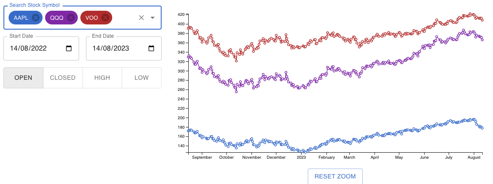

## Stock App

This is a sample application to display the price charts of selected stocks over a period of time. 

As the application is using the free tier of the finnhub api, the data is only limited to 1 year of historical data.

## Running the application

In a terminal, navigate to the root folder of this application, then run `npm install` to install the necessary dependencies. 

Then run `npm run start` and navigate to `http://localhost:3000` to view the application (if a browser didn't appear after typing in the command).

## Testing the application

To run the tests, from the same terminal, run `npm run test`

## Finnhub Token

The finnhub token can be set in the `.env` file. You can replace it with your own token by replacing the token after the test `REACT_APP_API_KEY=`.

